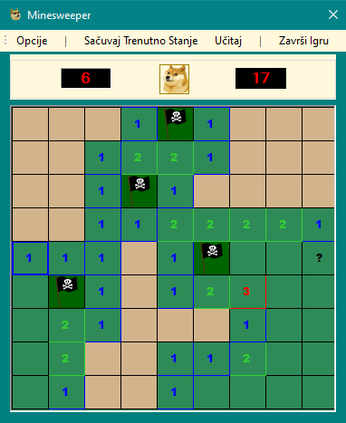
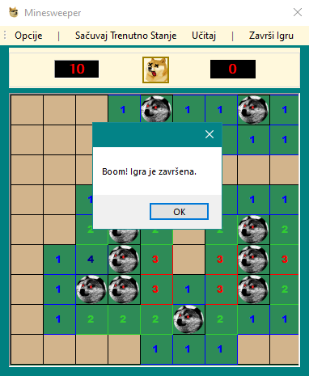

# Throwback: Minesweeper

  
  

## Description

This project is a nostalgic look back at an optional assignment I completed during my first year in Computer Science, for a course called Object Oriented Projecting. It's a simple implementation of Minesweeper developed in C# using Windows Forms for the UI (which, in hindsight, feels quite outdated, but that's what we used). This project is more of a sentimental `throwback` than a representation of my skills. I won't get into the details of the code, but feel free to roam around if you'd like. (keep in mind that most of the code and comments are in my home language, so you may need to use a translator for english)

From what I remember and what I quickly reviewed before writing this README, the game includes multiple difficulty levels that change the field size and resolution, saving and loading games through XML serialization, and common controls for starting and ending the game. There is also a timer (right side) and a counter for flagged positions (left side).

Despite some cringe-worthy code, this project holds a special place in my heart. One aspect I'm particularly proud of is the unique styling. Originally, we were supposed to go with a plain gray theme, but I decided to get creative with a `Doge theme`, probably because the image was conveniently on my desktop and seemed the most fitting out of them all for an university project. Additionally, green and brown themed minefield should represent a grass field, which is another nice visual touch if I can say so myself.
